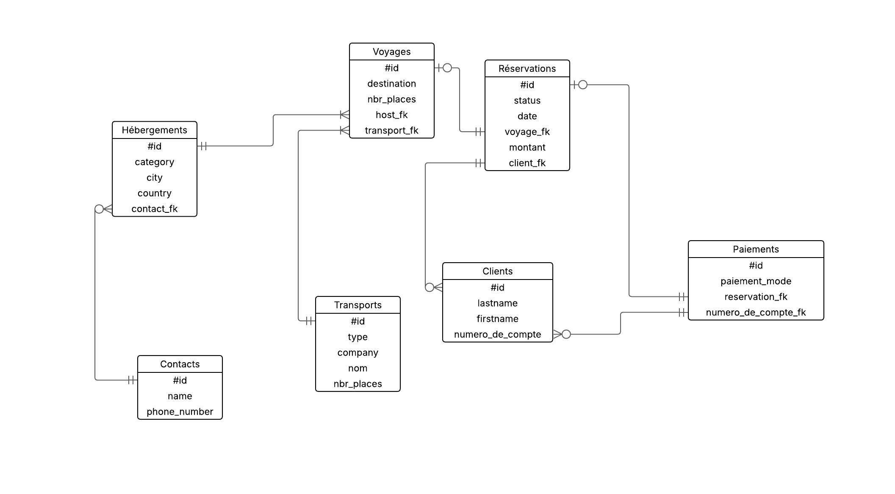
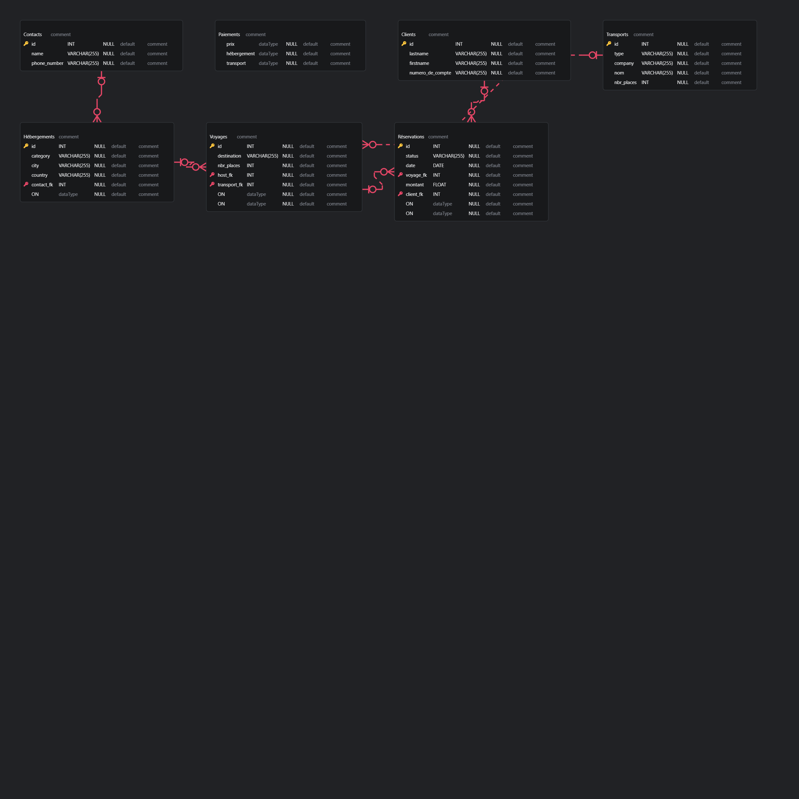

# Entity-Relation
This repository is dedicated to learning and practicing concepts related to Entity-Relationship modeling. It covers the following topics:

- **MCD (Merise Conceptual Data Model)**: A high-level representation of the data and its relationships.
- **MPD (Merise Physical Data Model)**: A detailed representation of how data is stored in a database.
- **MLD (Merise Logical Data Model)**: A bridge between the conceptual and physical models, focusing on the logical structure of the database.

Below are examples of diagrams used in Entity-Relation modeling:

### Entity-Relation Diagram

This diagram illustrates the relationships between entities in a database system. It serves as a foundational tool for designing and understanding database structures.

### Database Schema

This schema provides a detailed view of the database structure, including tables, columns, and relationships.

Feel free to explore and contribute!

